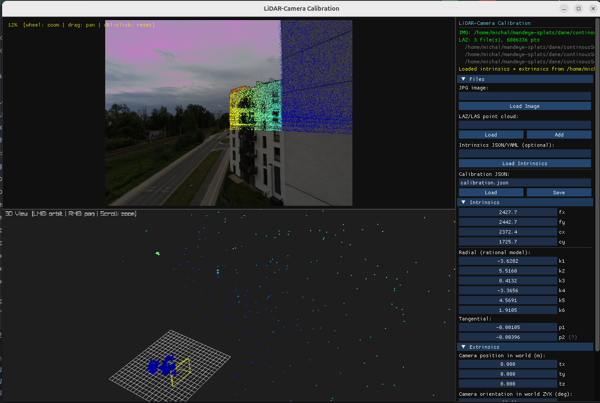
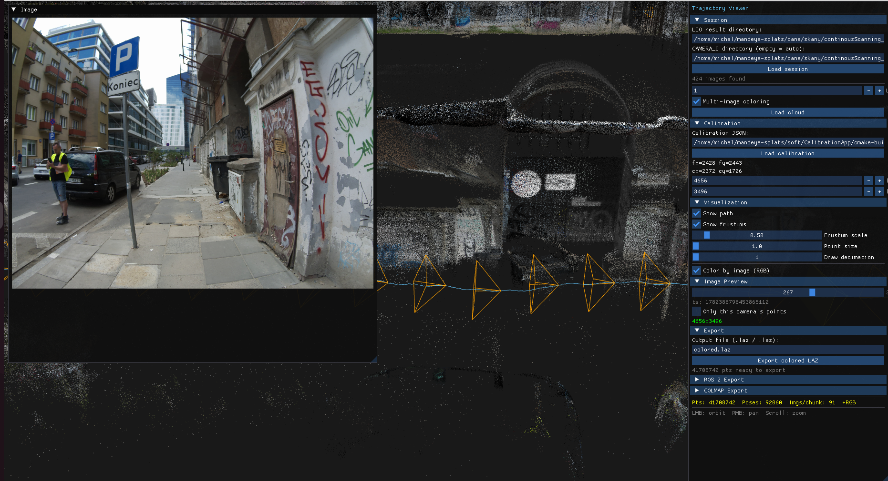
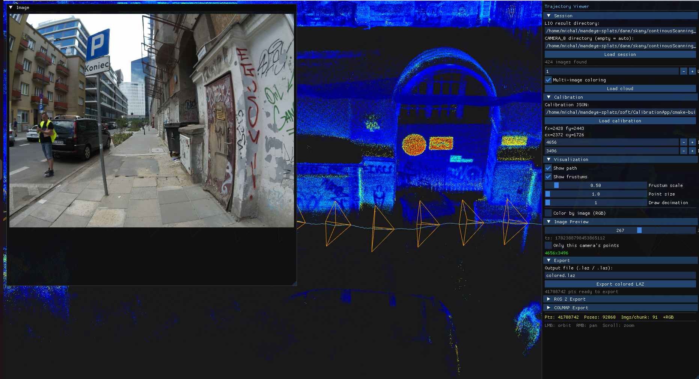
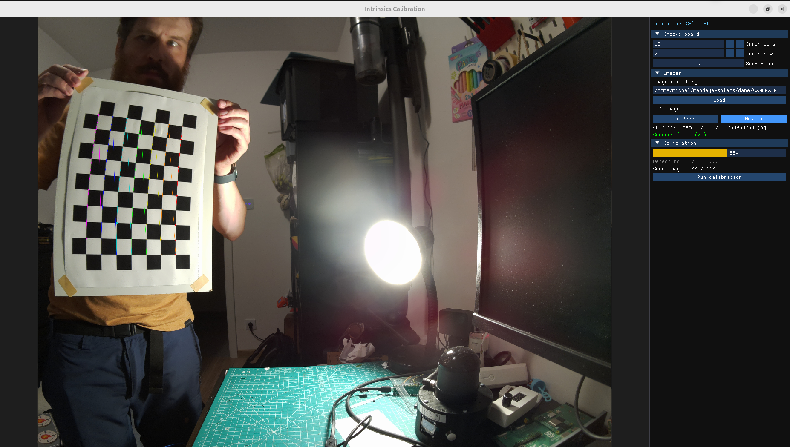

# CalibrationApp

A LiDAR–camera calibration toolkit with a GPU-accelerated 3D viewer. Provides three standalone tools for extrinsic calibration, trajectory visualization, and camera intrinsic calibration.

## Tools

| Executable | Purpose |
|---|---|
| `CalibrationApp` | Interactive extrinsic calibration — align LiDAR point clouds to camera images |
| `TrajectoryViewer` | Visualize sensor trajectories; export to ROS 2 bag or COLMAP sparse model |
| `IntrinsicsCalib` | Checkerboard-based camera intrinsic calibration |

## Screenshots

### CalibrationApp — LiDAR points projected onto camera image


### TrajectoryViewer — RGB coloring from camera


### TrajectoryViewer — LiDAR intensity coloring


### IntrinsicsCalib — checkerboard detection


## Features

### CalibrationApp
- Load LAS/LAZ point clouds (multiple files merged into one scene)
- Load camera images (JPG, PNG, BMP) with automatic undistortion when intrinsics are present
- Adjust extrinsics (position + ZYX Euler rotation) with real-time reprojection feedback
- Visualize projected points colored by depth, intensity, height, or camera RGB
- Save/load calibration as JSON

### TrajectoryViewer
- Render multi-camera LiDAR trajectories with per-camera point filtering
- Optional ROS 2 bag export (requires ROS 2 at build time)
- COLMAP sparse model export (`points3D.ply`, adjustable decimation)
- Toggle point coloring between LiDAR intensity and camera RGB (Ctrl)

### IntrinsicsCalib
- Automatic checkerboard detection on image sequences
- 8-parameter rational distortion model (k1–k6, p1, p2)
- Outputs intrinsics JSON compatible with CalibrationApp

## Dependencies

### Fetched automatically by CMake
- [raylib 5.5](https://github.com/raysan5/raylib)
- [Dear ImGui v1.92.8](https://github.com/ocornut/imgui)
- [rlImGui](https://github.com/raylib-extras/rlImGui)
- [nlohmann/json v3.11.3](https://github.com/nlohmann/json)

### Git submodules
- Eigen 3 (`3rdparty/eigen`)
- LASzip (`3rdparty/LASzip`)

### System
- CMake 3.20+
- C++17 compiler
- OpenGL 3.3+
- OpenCV (system-installed)
- **Linux only:** X11 dev libraries (`libx11-dev`, `libxrandr-dev`, `libxinerama-dev`, `libxcursor-dev`, `libxi-dev`)
- **Optional:** ROS 2 (`rosbag2_cpp`, `rclcpp`) for bag export in TrajectoryViewer

## Building

```bash
git clone --recursive <repo-url>
cd CalibrationApp

cmake -B build -DCMAKE_BUILD_TYPE=Release
cmake --build build --parallel
```

On Linux, install X11 dependencies first:
```bash
sudo apt install libx11-dev libxrandr-dev libxinerama-dev libxcursor-dev libxi-dev
```

To enable ROS 2 bag export (optional):
```bash
cmake -B build -DCMAKE_BUILD_TYPE=Release -DWITH_ROS2=ON
```

## Usage

### CalibrationApp

```bash
# Named arguments
CalibrationApp --camera_dir images/ --laz cloud.laz --calib previous.json

# Positional (auto-detected by extension)
CalibrationApp image.jpg lidar_points.laz

# Options
--camera_dir <dir|file>     Directory or single image file
--laz <a.laz> [b.laz ...]  One or more point clouds (LAS/LAZ); can repeat
--calib <file.json>         Full calibration file (intrinsics + extrinsics)
--mjs <file.mjs>            Session manifest file
-h, --help                  Print usage and exit
```

### TrajectoryViewer

```bash
TrajectoryViewer --camera_dir images/ --laz trajectory.laz --calib calib.json
```

### IntrinsicsCalib

```bash
IntrinsicsCalib --camera_dir checkerboard_images/
```

## UI Controls

### CalibrationApp viewport
| Input | Action |
|---|---|
| Left-click drag | Pan image |
| Scroll wheel | Zoom (centered on cursor) |
| Double-click | Reset view |
| Mouse drag (3D view) | Orbit camera |
| Alt | Toggle LiDAR intensity / camera RGB coloring |
| Shift | Fine-tuning mode (10× finer parameter steps) |

### Control panel
- **Files** — load images, point clouds, intrinsics, and calibration files
- **Intrinsics** — adjust fx, fy, cx, cy and distortion coefficients
- **Extrinsics** — adjust camera position (tx, ty, tz) and rotation (rx, ry, rz in ZYX Euler degrees)
- **Visualization** — point size, color mode, opacity, depth range

## Calibration File Format

```json
{
  "intrinsics": {
    "fx": 800.0, "fy": 800.0,
    "cx": 640.0, "cy": 360.0,
    "k1": 0.0, "k2": 0.0, "k3": 0.0,
    "k4": 0.0, "k5": 0.0, "k6": 0.0,
    "p1": 0.0, "p2": 0.0
  },
  "extrinsics": {
    "camera_position_in_world_xyz": [0.0, 0.0, 0.0],
    "camera_rotation_in_world_euler_zyx_deg": [0.0, 0.0, 0.0]
  }
}
```

Intrinsics can also be loaded from OpenCV YAML calibration files.

## Coordinate Convention

- Camera frame: X right, Y down, Z forward
- Extrinsic rotation: ZYX Euler angles (degrees), applied as world→camera transform
- Distortion model: OpenCV rational model (8 coefficients)

## Supported File Formats

| Format | Extension | Tool |
|---|---|---|
| Images | `.jpg`, `.png`, `.bmp` | All |
| Point clouds | `.las`, `.laz` | CalibrationApp, TrajectoryViewer |
| Calibration | `.json` | CalibrationApp |
| Intrinsics | `.json`, `.yml` | CalibrationApp, IntrinsicsCalib |
| Manifest | `.mjs` | All |

## CI

Builds are tested on Linux (Ubuntu latest) and Windows (Visual Studio, x64) via GitHub Actions.
